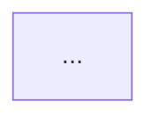
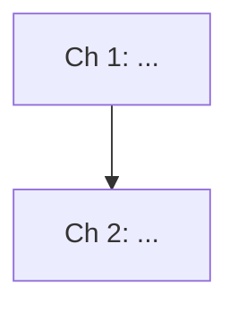

# Workspace File Formats

Templates for every file in `study/<book-name>/`. Follow them exactly so resume and review modes can parse state reliably.

## OVERVIEW.md

```markdown
# <Book Title>

- **PDF**: <path/to/file.pdf>
- **Pages**: 412
- **Language**: en
- **Mode**: study | auto
- **Notes**: <anything unusual: scanned pages, missing outline, etc.>

## Chapters

| # | Chapter | Pages |
|---|---------|-------|
| 01 | Introduction | 1–18 |
| 02 | Data Models | 19–54 |
| ... | ... | ... |

## Reading plan

<Any user preferences: chapters to skip, chapters flagged as critical, target pace.>
```

## PROGRESS.md

The state file. Update `last_page_done` at least every few pages during the page pass.

```markdown
# Progress

- **last_page_done**: 54
- **current_chapter**: 03
- **status**: in-progress | complete

## Chapters

| # | Chapter | Status | Completed | Next review | Interval |
|---|---------|--------|-----------|-------------|----------|
| 01 | Introduction | done | 2026-08-20 | 2026-08-27 | 7d |
| 02 | Data Models | done | 2026-08-22 | 2026-08-23 | 1d |
| 03 | Storage | in-progress | – | – | – |

## Pending

- <e.g. "checkpoint quiz for chapter 03 not yet taken">
```

Interval progression: `1d → 3d → 7d → 14d → 30d → 30d...`. A failed review resets the chapter to `1d`.

## chapters/NN-chapter-name/page-notes.md

```markdown
# Chapter NN: <Name> — Page Notes

## Page 19

- <key idea>
- <key idea>
- **Term**: <term> — <one-line definition> (also added to glossary)
- **Why**: <claim> holds because <reason>


## Page 20

- (blank page / chapter divider — no content)
```

## chapters/NN-chapter-name/summary.md

```markdown
# Chapter NN: <Name> — Summary

## Key ideas

- <idea> (p. 21–24)
- <idea> (p. 30)

## How it fits together



## Terms introduced

<term>, <term>, <term> (see glossary)

## Open questions / weak spots

- <anything the quiz or Feynman checkpoint revealed>
```

## flashcards.md

```markdown
# Flashcards

## Chapter 02: Data Models

**Q**: <question>
**A**: <answer>
Tags: chapter-02

**Q**: <question>
**A**: <answer>
Tags: chapter-02, weak
```

## flashcards.tsv

Tab-separated, no header, one card per line. Import into Anki via File → Import.

```
<front>	<back>	<book-name> chapter-02
<front>	<back>	<book-name> chapter-02 weak
```

Rules: no tab characters inside fields; replace internal newlines with `<br>`.

## glossary.md

```markdown
# Glossary

- **B-tree**: <definition> (p. 79)
- **LSM-tree**: <definition> (p. 76)
```

Keep alphabetized. One entry per term; if a later page refines a definition, update in place and add the new page ref.

## quiz-log.md

Append-only. One section per quiz session.

```markdown
## 2026-08-22 — Chapter 02 checkpoint

Score: 3/4 (75%) — PASS

1. [MC] <question> — correct
2. [MC] <question> — correct
3. [Recall] <question> — correct
4. [Why] <question> — **missed**: <what the user said> vs <right answer>
   → flashcard created (weak)

Feynman: explained <concept>. Gaps: missing <x>, vague on <y>.
```

## SUMMARY.md

```markdown
# <Book Title> — Master Summary

## The big picture



## The N things worth remembering

1. <idea> (ch. 2, p. 40)
2. ...

## Chapter-by-chapter in one line each

- **01 Introduction**: <one line>
- **02 Data Models**: <one line>
```
